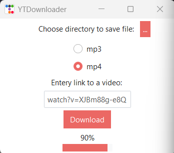

YT Downloader

A Python program made with pytubefix that lets you download YouTube videos in MP4 or MP3 format. You can choose where you want the downloaded file to be saved. A progress bar shows the download percentage.



## Notes

When downloading in MP4 format, the program first downloads the video and audio streams separately, as YouTube provides them as separate streams for most high-quality videos. The streams are then merged using imageio_ffmpeg.

## Features

- Download videos in MP3 or MP4 format.
- Select the download location.
- Real-time download progress bar.
- Automatically merges video and audio for MP4 downloads.
- Simple graphical user interface.

## Requirements

- Python 3.10+
- pytubefix
- imageio_ffmpeg
- ttkbootstrap

  ```bash
pip install pytubefix imageio_ffmpeg ttkbootstrap
```

## Running the program

```bash
git clone <repo-url>
cd YT_downloader
python ytD.py
```
